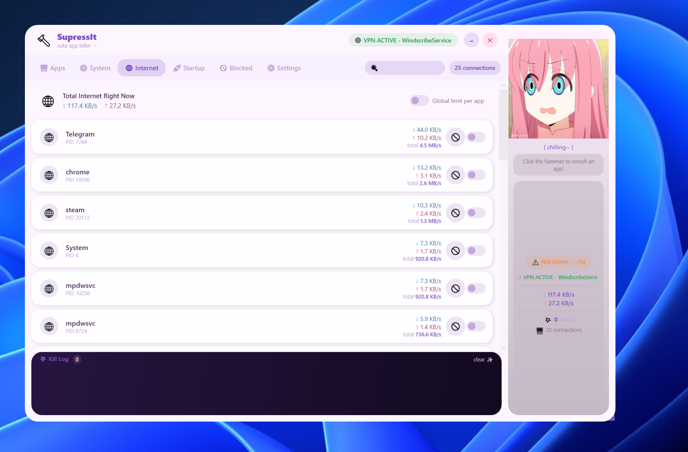

## Screenshot




# SupressIt

SupressIt is a Windows WPF utility for monitoring running apps, services,
network activity, startup entries, and blacklist enforcement from one compact
interface. It is built around a playful anime-style side panel, but the core
purpose is practical: inspect what is running, stop unwanted processes or
services, block repeat offenders, and keep startup clutter under control.

## Features

- View and search running processes with CPU, memory, download, and upload data.
- Kill a process or add it to the blacklist for repeat enforcement.
- View Windows services, start or stop them, and blacklist services.
- View network-connected processes and block selected processes.
- Monitor startup entries from registry startup keys, startup folders, scheduled
  tasks, and WMI startup command fallback data.
- Enable or disable supported startup entries.
- Maintain a blacklist of blocked processes and services.
- Customize theme colors, background media, GIF/video animations, and sounds.
- Show warning badges and confirmation prompts for truly critical Windows
  processes and services.

## Critical System Warnings

SupressIt marks only high-risk Windows components as critical. These are items
that can destabilize Windows, crash the session, or force a restart when killed
or stopped. Ordinary Windows maintenance services such as update/background
services are not treated as critical just because they belong to Windows.

Critical rows show a small warning badge over the normal icon. If you try to
kill, stop, or blacklist one of these entries, SupressIt asks for confirmation
before continuing.

Examples of protected core items include:

- `csrss`
- `wininit`
- `winlogon`
- `services`
- `lsass`
- core services such as `RpcSs`, `DcomLaunch`, `LSM`, and `SamSs`

## GIF And Video Animations

The GIF settings tab supports manual file selection and an app-folder mode.

When `Use app GIF folder` is enabled, SupressIt creates and reads this folder:

```text
<app directory>\GIF
```

Put files in that folder using these names:

```text
idle.gif / idle.webm / idle.mp4
search.gif / search.webm / search.mp4
kill.gif / kill.webm / kill.mp4
block.gif / block.webm / block.mp4
```

The resolver also supports `.avi` as a fallback video format.

Supported animation formats:

- `.gif`
- `.webm`
- `.mp4`
- `.avi`

GIF/APNG-style playback uses `AnimatedImage.Wpf`. WebM and MP4 playback use
WebView2 so short clips can loop instead of freezing after the first play.

## Sound Files

The Sound settings tab also supports manual file selection and an app-folder
mode.

When `Use app Sound folder` is enabled, SupressIt creates and reads this folder:

```text
<app directory>\Sound
```

Put files in that folder using these names:

```text
idle.wav / idle.mp3 / idle.ogg
search.wav / search.mp3 / search.ogg
kill.wav / kill.mp3 / kill.ogg
block.wav / block.mp3 / block.ogg
```

Supported sound formats:

- `.wav`
- `.mp3`
- `.ogg`
- `.m4a`
- `.aac`
- `.flac`
- `.wma`

If no custom kill/block sound is found, SupressIt falls back to the Windows
system exclamation sound.

## Startup Tab Coverage

The Startup tab reads more than simple registry startup keys. It includes:

- `HKCU` and `HKLM` Run entries
- RunOnce entries
- 32-bit startup registry entries
- user and common Startup folders
- visible scheduled tasks triggered at logon or boot
- WMI startup command fallback entries

Entries that can be safely toggled show an enable/disable button. Fallback
entries that cannot be toggled safely are shown as read-only.

## Settings

User settings are stored under:

```text
%APPDATA%\SupressIt\settings.json
```

This includes theme colors, media paths, sound paths, folder-mode checkboxes,
animation speeds, and general options.

## Requirements

- Windows
- .NET 9 Windows desktop runtime
- WebView2 runtime for `.webm` and `.mp4` animation playback
- Administrator permissions for stopping system services and killing protected
  processes

## Project Notes

SupressIt is a WPF application targeting:

```text
net9.0-windows
```

Main packages used by the app include:

- `CommunityToolkit.Mvvm`
- `Microsoft.Data.Sqlite`
- `System.Management`
- `System.ServiceProcess.ServiceController`
- `AnimatedImage.Wpf`
- `Microsoft.Web.WebView2`

## Safety

SupressIt can stop processes and services. Use the warning badges seriously,
especially around core Windows components. Killing ordinary apps is usually
safe; killing critical Windows processes or stopping critical Windows services
can crash the current Windows session or require a restart.
